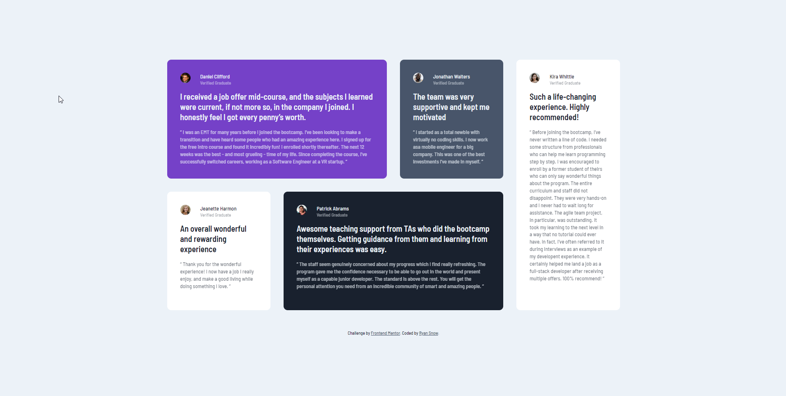

# Frontend Mentor - Testimonials grid section solution

This is a solution to the [Testimonials grid section challenge on Frontend Mentor](https://www.frontendmentor.io/challenges/testimonials-grid-section-Nnw6J7Un7). Frontend Mentor challenges help you improve your coding skills by building realistic projects.

## Table of contents

- [Overview](#overview)
  - [The challenge](#the-challenge)
  - [Screenshot](#screenshot)
  - [Links](#links)
- [My process](#my-process)
  - [Built with](#built-with)
  - [What I learned](#what-i-learned)
  - [Continued development](#continued-development)
  - [Useful resources](#useful-resources)
- [Author](#author)
- [Acknowledgments](#acknowledgments)

## Overview

### The challenge

Users should be able to:

- View the optimal layout for the site depending on their device's screen size

### Screenshot

### Links

- Solution URL: https://github.com/RSnow20/fem-testimonials-grid
- Live Site URL: https://rsnow20.github.io/fem-testimonials-grid/

## My process

### Built with

- Semantic HTML5 markup
- CSS custom properties
- Flexbox
- CSS Grid
- Media Queries

### What I learned

I learned a lot about CSS's grid-templates-areas property.

This feature is very versatile and can be used to effortlessly create multiple layouts with the same content.

### Continued development

I would like to focus more on less "hard coding" any sort of element size or spacing. IT will help me create responsive websites that do not overflow/get squished

## Acknowledgments

Kevin Powell - https://www.youtube.com/@KevinPowell

This channel has helped me develope my front end skills significantly. Kevin explains the WHY in what he does, which helps vastly when using it in other projects instead of just "doing it because he did it"
